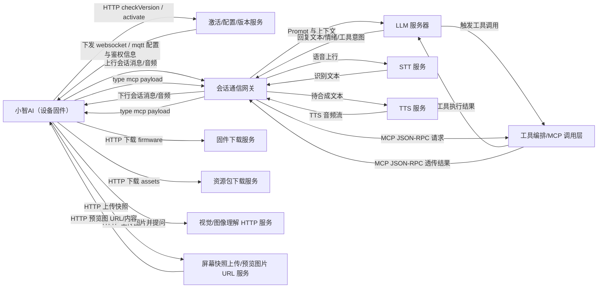
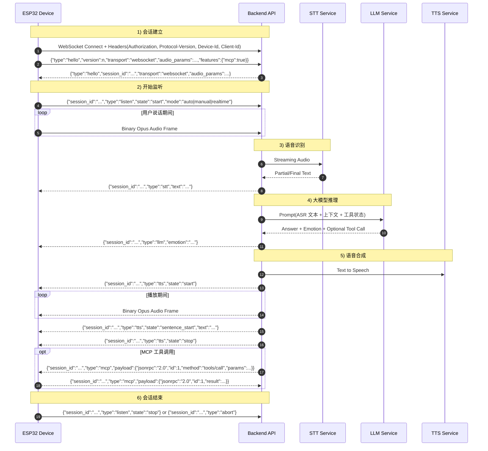

# 小智AI 与 LLM 通讯链路（设备-服务端-模型）

本文基于当前固件源码整理：设备端不直接调用大模型 API，而是先与业务服务端建立会话通道，由服务端完成 STT/LLM/TTS 编排，再把结果回传设备。

## 1. 系统全局结构图

## 2. 全链路时序图（WebSocket 主路径）

## 3. MQTT+UDP 变体（差异点）

- 控制面：走 MQTT（`hello/listen/stt/tts/mcp/goodbye` 这类 JSON）。
- 媒体面：走 UDP（Opus 音频，AES-CTR 加密，含 `nonce/sequence/timestamp`）。
- 建链过程：设备先 MQTT 发送 `hello(transport=udp)`，服务端回 `udp.server/port/key/nonce`，再建立 UDP 音频通道。

## 4. 关键消息清单

- 设备上行
  - `type=hello`
  - `type=listen, state=start|stop|detect`
  - `type=abort`
  - `type=mcp`
  - Binary Opus Audio
- 服务端下行
  - `type=hello`
  - `type=stt`
  - `type=tts, state=start|sentence_start|stop`
  - `type=llm`（如 `emotion`）
  - `type=mcp`
  - `type=system`（如 `reboot`）
  - Binary Opus Audio

## 5. 对应源码锚点

- 协议抽象与消息发送：`main/protocols/protocol.h`, `main/protocols/protocol.cc`
- WebSocket 实现：`main/protocols/websocket_protocol.cc`
- MQTT+UDP 实现：`main/protocols/mqtt_protocol.cc`
- 消息分发与状态机：`main/application.cc`
- 音频编解码流水线：`main/audio/audio_service.h`, `main/audio/audio_service.cc`
- MCP 消息处理：`main/mcp_server.cc`
- 协议配置来源（OTA 下发并写入 settings）：`main/ota.cc`
