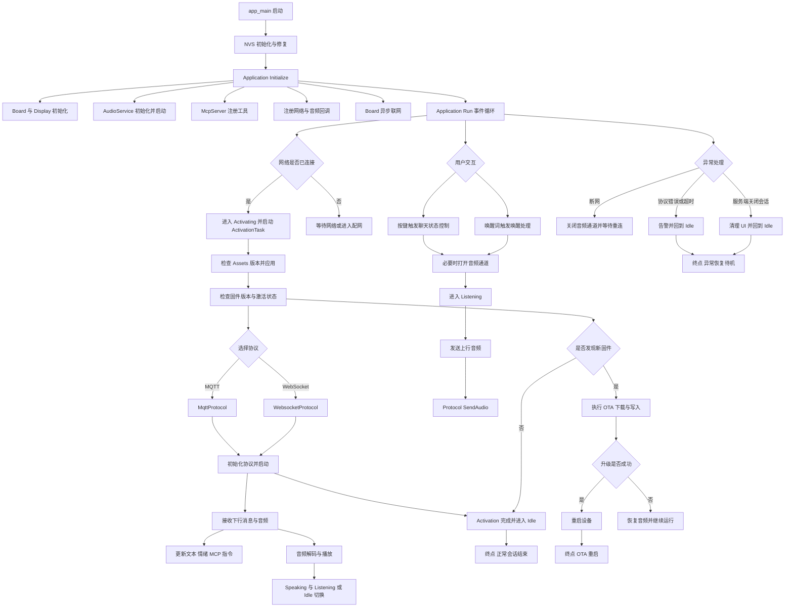
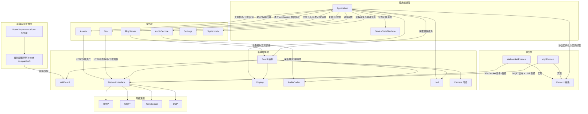

# 小智AI 源码分析图（Mermaid）

## 1. 分析范围与方法
- 范围：基于当前仓库 `main/` 全量源码，重点覆盖启动、网络、激活、协议、音频、状态机、MCP、OTA、板级抽象与板型扩展。
- 方法：先做目录级全扫描，再按主调用链追踪关键入口与回调（`main.cc -> Application -> Board/Audio/Protocol/Ota/Mcp`），最后对照实现文件补齐异常分支与恢复分支。
- 目标：输出两张图。
  - 工作流程图：全链路主流程（上电到会话、异常恢复、升级重启）。
  - 模块图：核心层 + 扩展层（聚合板型，不逐个展开 90+ 板目录）。

## 2. Mermaid 工作流程图（全链路）

## 3. Mermaid 模块图（核心层 + 扩展层）

## 4. 图例与边关系说明（调用/事件/数据流）
- 节点含义
  - 矩形节点：模块、类或阶段动作。
  - 菱形节点：条件分支或协议选择点。
  - `END*`：流程终点。
- 边类型
  - 调用流：`A --> B`，表示同步调用或直接控制关系。
  - 事件流：边标签含“事件/回调/状态变更”，表示异步触发（例如 EventGroup bit、网络回调、协议回调）。
  - 数据流：边标签含“上行/下行/下载/写入”，表示音频帧、JSON、资源或固件数据传输。
- 主流程约束
  - 启动后必须进入 `Application::Run` 事件循环。
  - 会话主链路以 `OpenAudioChannel -> Listening -> Send/Receive -> Idle` 闭环。
  - 异常分支统一回收到 Idle（可再次发起会话）。
  - OTA 成功分支以重启作为终止点。

## 5. 关键源码锚点（用于追溯图中节点）
- 启动与入口
  - `main/main.cc`
  - `main/application.h`
  - `main/application.cc`
- 事件循环与状态机
  - `main/device_state.h`
  - `main/device_state_machine.h`
  - `main/device_state_machine.cc`
- 音频链路
  - `main/audio/audio_service.h`
  - `main/audio/audio_service.cc`
- 协议抽象与实现
  - `main/protocols/protocol.h`
  - `main/protocols/protocol.cc`
  - `main/protocols/mqtt_protocol.h`
  - `main/protocols/mqtt_protocol.cc`
  - `main/protocols/websocket_protocol.h`
  - `main/protocols/websocket_protocol.cc`
- 板级抽象与网络配置
  - `main/boards/common/board.h`
  - `main/boards/common/board.cc`
  - `main/boards/common/wifi_board.h`
  - `main/boards/common/wifi_board.cc`
  - `main/boards/bread-compact-wifi/compact_wifi_board.cc`
- OTA、资源、配置、MCP
  - `main/ota.h`
  - `main/ota.cc`
  - `main/assets.h`
  - `main/assets.cc`
  - `main/settings.h`
  - `main/settings.cc`
  - `main/mcp_server.h`
  - `main/mcp_server.cc`
- 组件装配与板型聚合入口
  - `main/CMakeLists.txt`
