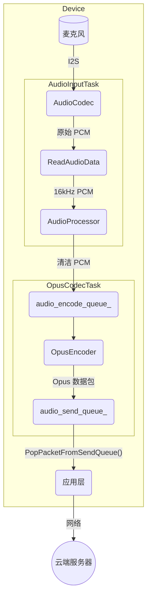
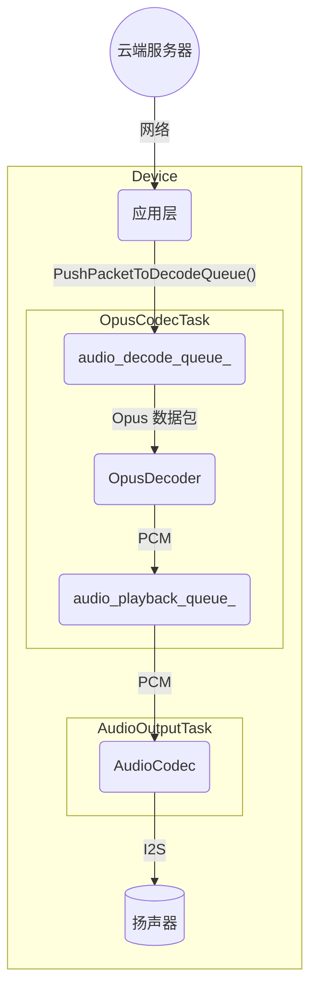

# 音频服务架构

音频服务是一个核心组件，负责管理所有音频相关功能，包括从麦克风捕获音频、处理音频、编码/解码以及通过扬声器播放音频。它采用模块化设计，运行效率高，主要操作在专用的 FreeRTOS 任务中运行，以确保实时性能。

## 核心组件

- **`AudioService`**：中央协调器。它初始化并管理所有其他音频组件、任务和数据队列。
- **`AudioCodec`**：物理音频编解码芯片的硬件抽象层 (HAL)。它处理原始 I2S 音频输入和输出通信。
- **`AudioProcessor`**：对麦克风输入流执行实时音频处理。通常包括声学回声消除 (AEC)、噪声抑制和语音活动检测 (VAD)。`AfeAudioProcessor` 是默认实现，利用 ESP-ADF 的音频前端。
- **`WakeWord`**：从音频流中检测关键词（如"你好，小智"、"Hi, ESP"）。在检测到唤醒词之前，它独立于主音频处理器运行。
- **`OpusEncoderWrapper` / `OpusDecoderWrapper`**：管理 PCM 音频到 Opus 格式的编码和 Opus 数据包解码回 PCM。使用 Opus 是因为其高压缩率和低延迟，非常适合语音流传输。
- **`OpusResampler`**：用于在不同采样率之间转换音频流的实用工具（例如，将编解码器的原始采样率重采样到处理所需的 16kHz）。

## 线程模型

服务在三个主要任务上运行，以并发处理音频流水线的不同阶段：

1. **`AudioInputTask`**：专门负责从 `AudioCodec` 读取原始 PCM 数据。然后根据当前状态将此数据提供给 `WakeWord` 引擎或 `AudioProcessor`。
2. **`AudioOutputTask`**：负责播放音频。它从 `audio_playback_queue_` 中检索解码后的 PCM 数据，并将其发送到 `AudioCodec` 以在扬声器上播放。
3. **`OpusCodecTask`**：一个工作线程，处理编码和解码。它从 `audio_encode_queue_` 中获取原始音频，将其编码为 Opus 数据包，并将它们放入 `audio_send_queue_`。同时，它从 `audio_decode_queue_` 中获取 Opus 数据包，将其解码为 PCM，并将结果放入 `audio_playback_queue_`。

## 数据流

有两种主要数据流：音频输入（上行链路）和音频输出（下行链路）。

### 1. 音频输入（上行链路）流程

此流程从麦克风捕获音频，对其进行处理，编码，并准备发送到服务器。

- `AudioInputTask` 不断从 `AudioCodec` 读取原始 PCM 数据。
- 此数据被输入到 `AudioProcessor` 进行清理（AEC、VAD）。
- 处理后的 PCM 数据被推送到 `audio_encode_queue_`。
- `OpusCodecTask` 获取 PCM 数据，将其编码为 Opus 格式，并将结果数据包推送到 `audio_send_queue_`。
- 然后应用程序可以检索这些 Opus 数据包并通过网络发送。

### 2. 音频输出（下行链路）流程

此流程接收编码的音频数据，对其进行解码，并在扬声器上播放。

- 应用程序从网络接收 Opus 数据包并将其推送到 `audio_decode_queue_`。
- `OpusCodecTask` 检索这些数据包，将其解码回 PCM 数据，并将数据推送到 `audio_playback_queue_`。
- `AudioOutputTask` 从队列中获取 PCM 数据并将其发送到 `AudioCodec` 进行播放。

## 电源管理

为了节省能源，音频编解码器的输入 (ADC) 和输出 (DAC) 通道在一段不活动时间（`AUDIO_POWER_TIMEOUT_MS`）后自动禁用。定时器（`audio_power_timer_`）定期检查活动并管理电源状态。当需要捕获或播放新音频时，通道会自动重新启用。
